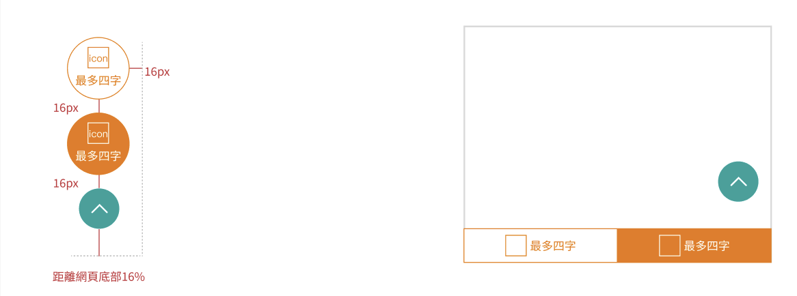

# 行銷頁面 eventpage
> 為使行銷活動可多元呈現，並擁有一致性的操作體驗，對於行銷頁面的Header、Footer功能頁面進行規範。

## Header
    依照需求不同表頭使用。

一般選單

下滑錨點

下拉選單

## Footer
    依據現行規範，各網頁Footer皆統一，但可根據是否有提到警示內容，決定是否需要加入警語。

公版表尾

## 浮動按鈕
    根據需求看要不要放上浮動按鈕，有分為線框、色塊兩種形式，並可根據需求加入icon。
    字數限制為每顆按鈕數字不得超過4字，手機版改變成為置底按鈕形式。
    如不需使用則皆可隱藏，只留下回到首頁上滑按鈕。

步驟圖示意

