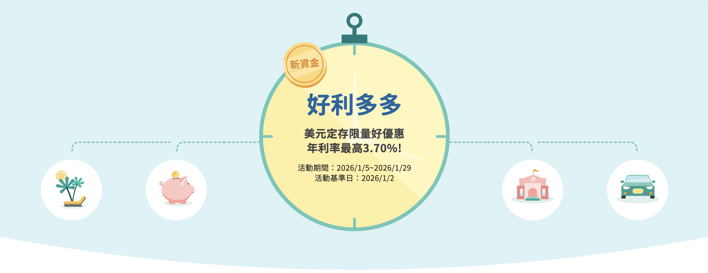

# Eventpage 行銷頁面 
> 為使行銷活動可多元呈現，並擁有一致性的操作體驗，對於行銷頁面的Header、Footer功能頁面進行規範。

## Header
```
依照需求不同表頭使用。
```

<p>一般選單</p>
<div class="container mx-auto my-8 px-4">

</div>
<p>下滑錨點</p>
<div class="container mx-auto my-8 px-4">

</div>
<p>下拉選單</p>
<div class="container mx-auto my-8 px-4">

</div>

## 首頁KV
```
主視覺色彩比重請參照Color 顏色，以產品色最淺色階為主(1-2階)，產品色為輔。
如果為照片情境示意，請挑選濾鏡感低接近自然色調、主題明確、清新明亮為主，請參照Photo 照片。
其餘插圖的使用，請參照Illustration 插圖。
```
<p>向量</p>
<div class="container mx-auto my-8 px-4">

</div>

<p>實景</p>
<div class="container mx-auto my-8 px-4">

</div>

## Footer
```
依據現行規範，各網頁Footer皆統一，但可根據是否有提到警示內容，決定是否需要加入警語。
```
<div class="container mx-auto my-8 px-4">

</div>

## 浮動按鈕
```
根據需求看要不要放上浮動按鈕，有分為線框、色塊兩種形式，並可根據需求加入icon。
字數限制為每顆按鈕數字不得超過4字，手機版改變成為置底按鈕形式。
如不需使用則皆可隱藏，只留下回到首頁上滑按鈕。
```
<div class="container mx-auto my-8 px-4">

</div>


<script setup>
import Button from "../components/Button.vue";
</script>